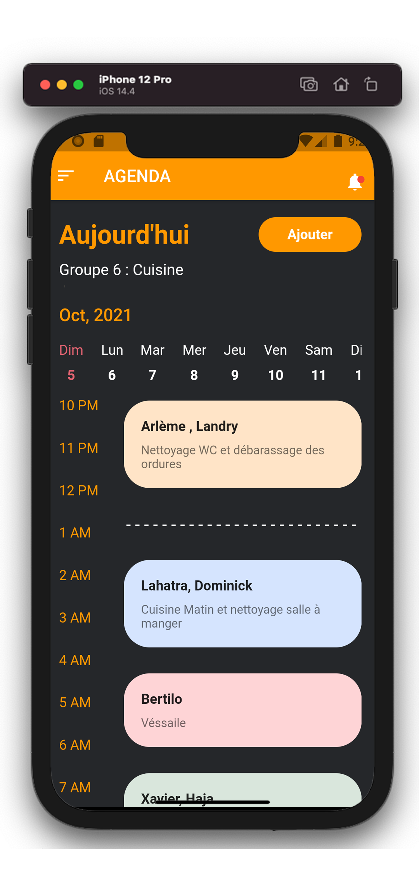
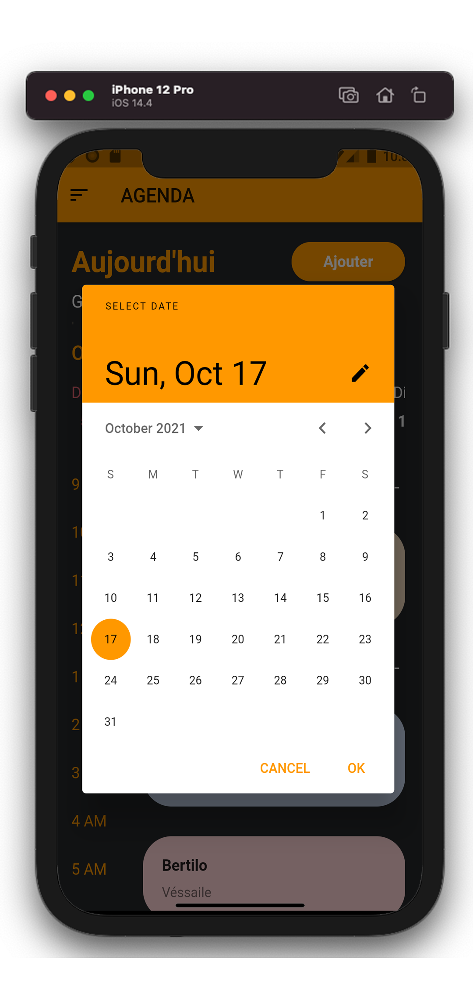
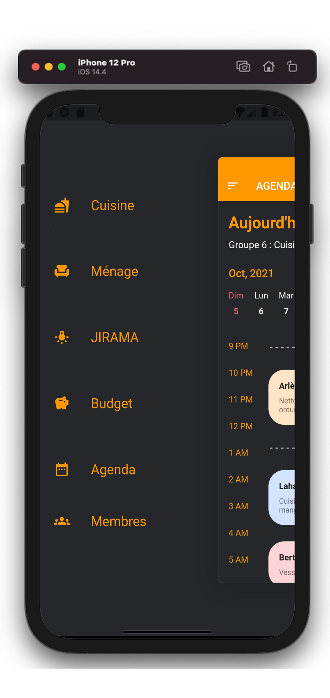

# GFS
GFS est une application multiplateforme qui permet de facilement la gestion d'une maison/foyer

# A quoi sert GFS ?
La gestion d'un foyer est une tâche importante, mais peu passionnante. Indispensable pour beaucoup de personnes, comme les étudiants, elle est souvent oubliée alors qu'elle pourrait éviter à beaucoup de jeunes la désorganisation et mauvais gestion de leurs ressources communes et individuelles. Notre application est une solution moderne face à ces problèmes du quotidien.

## Fonctionnalités
- Page d'acceuil qui regroupe les divers catégorie de l'application
- Page pour les tours de cuisine
- Page pour les tours de ménage
- Agenda contenant les tours et les tâches à faire pour chaque membres et/ou groupe dans le foyer.
- Page pour la géstion de budget individuel et commun pour le foyer
- Page qui contient dépense en JIRAMA des mois précedent et prévision des mois à venir.
- Page regroupant tous les membres du foyer

## Contributeurs

# Screenshoots

<table>
    <thead>
        <tr>
            <th colspan="3">AGENDA</th>
        </tr>
    </thead>
    <tbody>
        <tr>
            <td></td>
            <td></td>
            <td></td>
        </tr>
    </tbody>
</table>
<table>
    <thead>
        <tr>
            <th colspan="2">JIRAMA</th>
        </tr>
    </thead>
    <tbody>
        <tr>
            <td></td>
            <td></td>
            <td></td>
        </tr>
    </tbody>
</table>
<table>
    <thead>
        <tr>
            <th colspan="1">ITEMS</th>
        </tr>
    </thead>
    <tbody>
        <tr>
            <td></td>
            <td></td>
            <td></td>
        </tr>
    </tbody>
</table>